# Toptancım (Demo) — B2B Toptancı ↔ Müşteri Ticaret Uygulaması

**Toptancım**, toptancılar ile müşteriler (perakendeciler) arasındaki B2B sipariş ve tahsilat süreçlerini tek bir akışta toplayan bir **demo/prototip** uygulamadır.

Bu proje; ürün/varyant yönetimi, müşteri bazlı fiyatlandırma (etiket), çoklu sepet ile sipariş oluşturma, sipariş onay/teslim akışı ve finansal işlemlerin karşılıklı onayı gibi temel senaryoları **uçtan uca** göstermeyi hedefler.

> **Not:** Bu repo bir **demo** niteliğindedir. Üretim ortamı (production) ihtiyaçları için güvenlik, ölçeklenebilirlik, loglama/izleme, hata yönetimi, test kapsamı ve CI/CD gibi başlıklar ayrıca ele alınmalıdır.

---

## İçindekiler
- [Proje Tanıtımı](#proje-tanıtımı)
- [Kullanılan Teknolojiler](#kullanılan-teknolojiler)
- [Ekran Akışı (Senaryolu Demo)](#ekran-akışı-demo)
- [İleride Eklenmesi Planlanan Özellikler](#ileride-eklenmesi-planlanan-özellikler)

---

## Proje Tanıtımı

### Amaç
B2B ticarette en çok zaman kaybettiren noktalar genellikle şuralarda ortaya çıkar:
- ürünlerin güncel tutulması (varyant/stock/fiyat),
- müşteriyle siparişin mutabakata bağlanması,
- teslimat sonrası tahsilat/finans kayıtlarının doğru ve hızlı işlenmesi,
- müşteri segmentine göre fiyatların yönetilmesi.

**Toptancım**, bu problemleri tek bir uygulama akışında birleştirerek:
- **müşteri tarafında** hızlı alışveriş ve sepet yönetimi,
- **toptancı tarafında** ürün & sipariş kontrolü ve finansal onay mekanizması
sunmayı amaçlar.

### Vizyon
- Toptancı ile müşteri arasındaki “WhatsApp/telefonla sipariş + manuel takip” alışkanlığını,
  **izlenebilir**, **onaylı**, **şeffaf** ve **gerçek zamanlı** bir dijital sisteme dönüştürmek.
- Sipariş, teslim ve finans adımlarını “tek bir zincirin halkaları” gibi birbirine bağlamak:
  **Sepet → Sipariş Onayı → Teslim → Ticari İşlem → Finansal Kayıt**.

### Roller
- **Müşteri (Alıcı):** Ürünleri gezer, varyant seçer, sepete ekler, birden fazla sepet oluşturur, siparişi onaylar, finansal işlem oluşturur/iptal talebi açar.
- **Toptancı (Satıcı):** Ürün & varyant yönetir, siparişi onaylar/düzenler/teslim eder, finansal işlemi onaylar/reddeder, müşterileri etiketleyerek fiyat politikasını yönetir.

---

## Kullanılan Teknolojiler

### Frontend
- **Flutter** (Mobil/Web)
- **Provider** (state management)
- `http`, `shared_preferences`
- **Google Maps** entegrasyonu (harita desteği)
- **Socket** tabanlı gerçek zamanlı güncellemeler (örn. finansal işlemin iki tarafta anlık görünmesi)

### Backend
- **Node.js + Express**
- **PostgreSQL**
- **JWT** tabanlı kimlik doğrulama + yetkilendirme
- Dosya yükleme altyapısı (örn. finansal işlem kanıt fotoğrafı)
- **Socket** altyapısı (gerçek zamanlı akış)

## Ekran Akışı (Demo)

---

### 1) Sistem harita destekliyor (altyapı kanıtı)
Uygulama, harita tabanlı bir ekranı desteklediğini gösterir. Bu; ileride **adres/konum seçimi**, **rota**, **teslimat bölgesi** gibi modüllere zemin hazırlar.

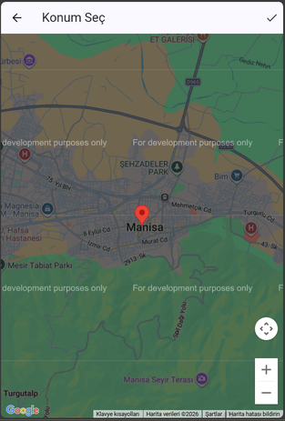

---

### 2) Giriş: sistemin kapısı
Kullanıcı, sistemin “iki rolü” (toptancı/müşteri) için de ortak olan giriş ekranından ilerler. Demo senaryosunda bu ekran, sisteme erişimin ilk adımıdır: doğru kullanıcıyla doğru panele giden kapı.

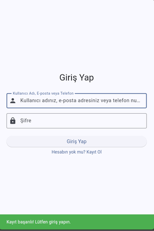

---

### 3) Profil: kim olduğun ve neye yetkin olduğun
Girişten sonra kullanıcı kendini görür:
- Profil özetini inceleyebilir,
- Gerekirse profil bilgilerini düzenleyebilir.
Bu ekran demo için kritik: “Kullanıcının hesabı var, tanımlı ve yönetilebilir” kanıtı.

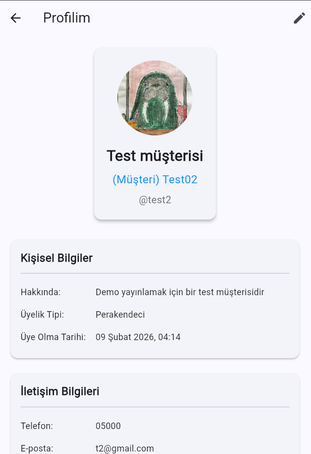

---

### 4) Menü: uygulamanın kontrol paneli
Menü ekranı, sistemde hangi modüllerin olduğunu netleştirir: bağlantılar, ürünler, sipariş/sepet, finans, etiketler, bildirimler…  

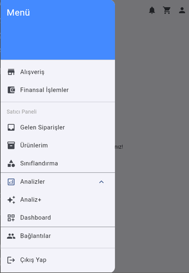

---

## Bağlantılar (Toptancının müşterileriyle ilişkisi)

### 5–6) Yeni bağlantı ekleme: ağı kurma
Toptancı açısından sistemin ilk işi “müşteri ağı”nı kurmaktır.
Bu ekranlar:
- yeni bir bağlantı eklemeyi,
- bunun hem **uygulama içi** hem de **harici** bağlantı olabileceğini
gösterir.

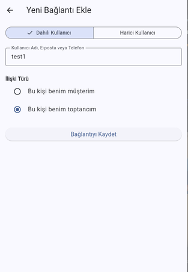
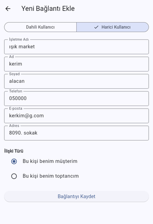

---

### 7) Bağlantılarım: kimler benim müşterim, kimler dışarıda?
Bağlantılar listesinde kullanıcı, müşteri/bağlantı ağını bir bakışta görür.
Özellikle **harici bağlantıların ayırt edilmesi**, saha gerçekliği için değerlidir: her müşteri uygulamayı kullanmak zorunda olmayabilir.

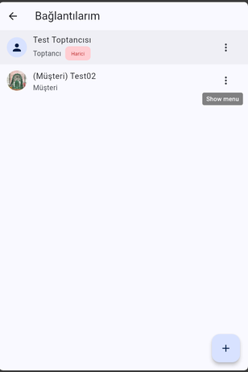

---

## Ürün Yönetimi (Toptancı Paneli)

### 8–9) Ürün ekleme: varyantlarıyla birlikte

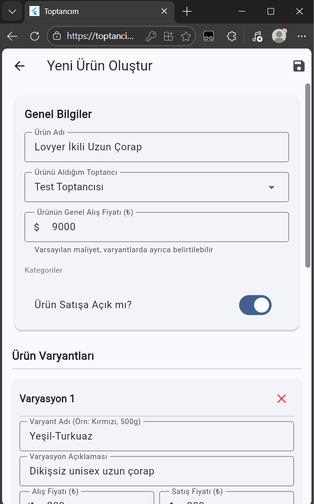
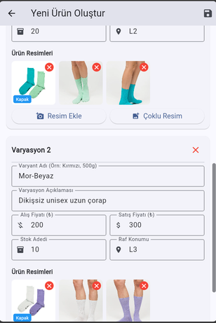

---

### 10) Ürün düzenleme: kontrol her zaman sende
Toptancı, eklediği ürünü sonradan düzenleyebilir.  
B2B dünyasında bu zorunluluktur: fiyat, stok, açıklama, görsel veya varyant bilgileri sık değişir.

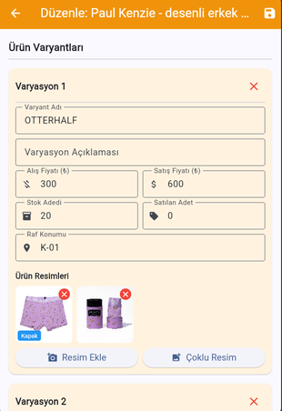

---

### 11) Ürünlerim: aktif/pasif ve yönetim görünümü
Bu ekran “katalog yönetimi”nin kalbidir:
- ürünler listelenir,
- ürünlerin **aktif/pasif** gibi durumları yönetilebilir,
- toptancı ürünlerini tek yerden kontrol eder.

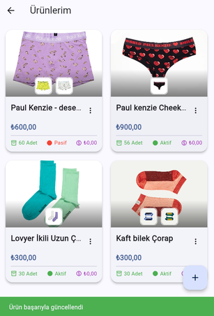

---

## Müşteri Alışverişi (Müşteri Paneli)

### 12) Alışveriş sekmesi: müşteri vitrini
Müşteri tarafı, ürünleri kategorik/akış halinde görür.
Bu ekran, müşterinin “siparişe giden yolculuğunu” başlatır.

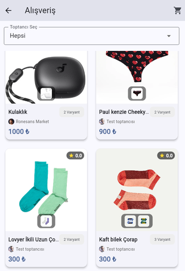

---

### 13–14) Ürün satın alma: ürün detayı → varyant → sepete ekle
Müşteri, ürünü inceler; gerekiyorsa varyant seçer ve sepete ekler.
Bu iki ekran birlikte, demo hikâyenin “müşteri kararı” anını temsil eder.

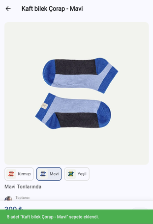

---

### 15) Çoklu sepet: aynı anda birden fazla sipariş taslağı
B2B’de müşteri çoğu zaman:
- farklı şubeler için,
- farklı teslim tarihleri için,
- farklı ürün grupları için
ayrı sepetler oluşturmak ister.

Bu ekran, **çoklu sepet** oluşturulabildiğini ve mevcut sepetin **onaya gönderilme** mantığını gösterir.

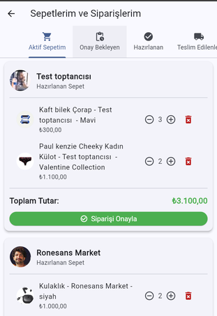

---

## Sipariş Onay Akışı (Müşteri → Toptancı)

> Bu bölümde kritik kural: **önce müşteri onaylar**, sonra **toptancı inceler/onaylar**.

### 16) Müşteri: onay bekleyen sepetler
Müşteri, oluşturduğu sepetleri görür ve “bu sepet siparişe dönüştü mü?” durumunu takip eder.
Bu ekran; müşterinin kendi tarafında bekleyen/onay sürecini görmesini sağlar.

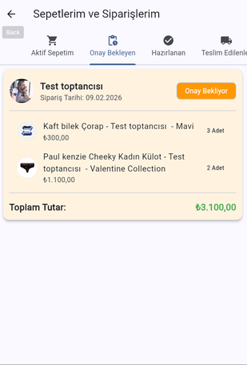

---

### 17) Toptancı: müşteriden onaylanmış sepet geldi!
Artık top toptancıdadır:
Müşteri sepeti onayladıysa, toptancı panelinde bu sepet **işlenebilir bir sipariş** olarak görünür.

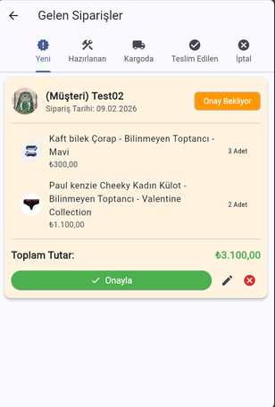

---

### 18) Toptancı: siparişi onaylama
Toptancı siparişi inceler ve onaylar.
Buradaki amaç; siparişin toptancı tarafında “resmiyet kazanması”dır.
Onay, bir sonraki adım olan düzenleme/teslim süreçlerini açar.

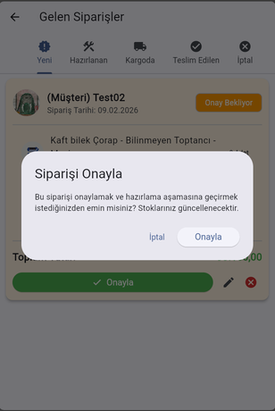

---

### 19) Toptancı: sepet/sipariş düzenleme
Gerçek hayatta siparişler çoğu zaman birebir aynı kalmaz:
- müşterinin fiziksel gözle beğenmediği ürün çıkar,
- başka ürün alabilir,
- adet güncellenir.

Bu ekran, toptancının siparişi teslimata hazırlamadan önce düzenleyebildiğini gösterir.

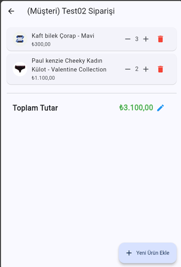

---

### 20) Toptancı: sepeti teslim etme + “Ticari İşlemi Uygula”
> Sipariş teslim edilir, “**Ticari İşlemi Uygula**” ile teslimata bağlı **finansal kaydın** otomatik/bağlantılı şekilde işlenmesi temeli oluşturulur.

Bu strateji sayesinde sipariş ve finans kayıtları kopmaz:
> “Teslim olduysa, muhasebe/finans hareketi de iz bırakmalıdır.”

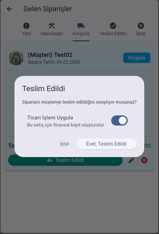

---

### 21) Müşteri: onaylanmış/sonuçlanmış sepeti görme
Müşteri tarafında artık siparişin sonucu görünür:
- sipariş onaylandı mı,
- teslim edildi mi,
- süreç hangi aşamada?

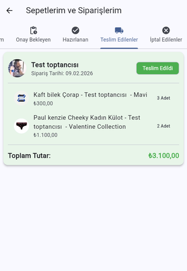

---

## Finansal İşlemler (Gerçek zamanlı & karşılıklı onay)

### 22) Anlık finans güncellemesi: iki taraf aynı anda görüyor
- Sol taraf müşteri,
- sağ taraf toptancı.
Finansal işlemlerin **gerçek zamanlı** olarak iki tarafta da eş zamanlı güncellenebildiğini gösterir.

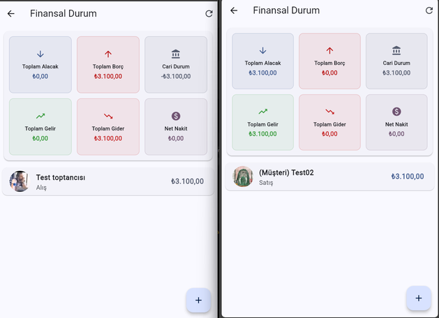

---

### 23) Yeni finansal işlem: kayıt oluşturma
Müşteri (veya süreçteki rol), yeni bir finansal işlem başlatır.
Bu; “ödeyeceğim / ödedim / tahsilat / düzeltme” gibi hareketlerin kayıt altına alınmasının başlangıcıdır.

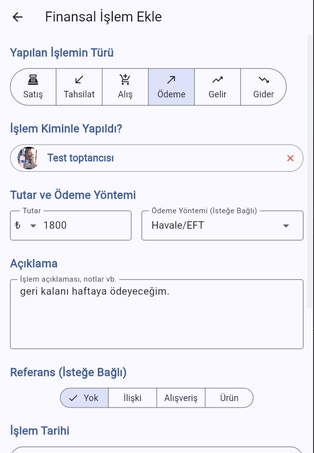

---

### 24) Kanıt fotoğrafı: finansal işlemin delillendirilmesi
B2B’de “dekont/fiş/görsel kanıt” sıkça istenir.
Bu ekran, finansal işlem kaydına **kanıt fotoğrafı eklenebildiğini** gösterir.

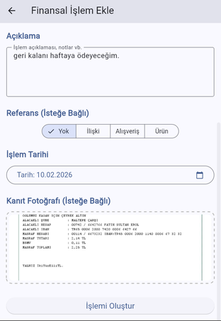

---

### 25) Finansal işlemin gerçekleştiğine dair kanıt
İşlem oluşturulduktan sonra sistemde kayıtlı hale gelir.

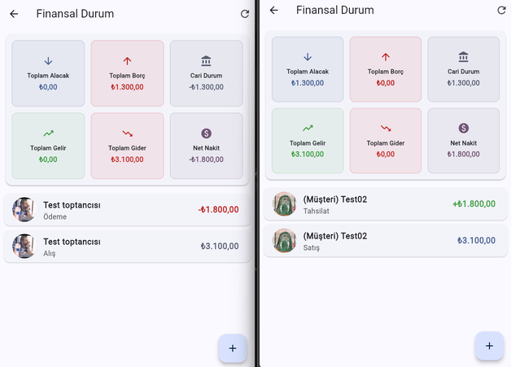

---

### 26) Toptancı: finansal işlemi onayla / reddet
En kritik güven mekanizması:
Finansal işlem tek taraflı “bitti” sayılmaz.
Toptancı tarafından **onay** veya **ret** ile mutabakata bağlanır.

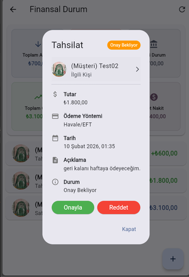

---

### 27) Müşteri: finansal işlem iptal talebi oluşturma
Müşteri, bir işlem için iptal talebi açabilir.
Bu; hatalı girişler veya sonradan değişen anlaşmalar için “düzenli bir geri alma” mekanizmasıdır.

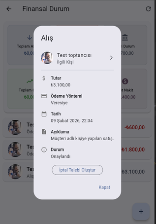

---

## Bildirimler & Etiket Bazlı Fiyatlandırma

### 28) Bildirimler: sistemin nabzı
Sipariş onayı, finansal onay, iptal talepleri…  
Bildirim ekranı, toptancının “kaçırmaması gereken” olayları tek yerde toplar.

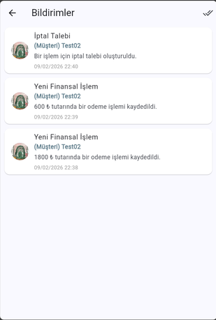

---

### 29) Etiket oluşturma: müşteri segmentasyonu
Toptancı, müşteri grupları için etiketler oluşturur:
- “VIP”
- “Yeni müşteri”
- “Bayi”
gibi.

Bu, fiyat politikasının ve kampanyaların temelidir.

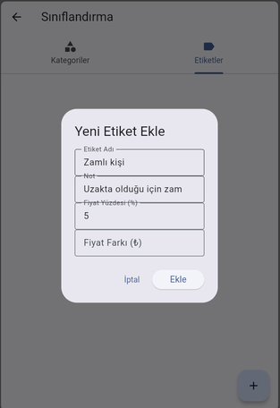

---

### 30) Müşteri ayarları: etikete ekleme ve özellikleri görme
Toptancı, müşteri detayını görür ve etikete ekleyebilir.
Bu ekran; müşteri yönetiminin “hızlı aksiyon” tarafını güçlendirir.

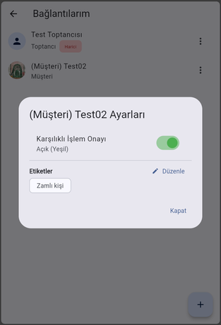

---

### 31) Müşteri: etiket sonucunda değişen fiyatlar
Etiketin ürünlere yansıdığı an burasıdır:
Müşteri, etiket politikasına göre ürünleri **farklı fiyat** ile görebilir.
Müşteri ürünleri başka kişiden görmediği sürece kendisinde bir etiket olmadığını bilemez.

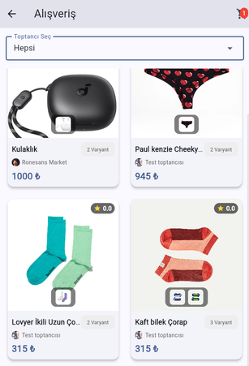

---

### 32) Toptancı: müşteri profili ve hızlı ayarlar
Müşteri profili üzerinden hızlı ayarlar ve pratik aksiyonlar.
Toptancı, müşteri ilişkisini tek ekrandan yönetebilir.

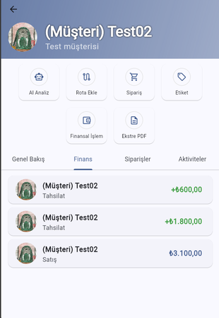

---

## İleride Eklenmesi Planlanan Özellikler

### Dashboard
- Toptancının belirli etiketteki kişilere götüreceği malların listesi (örnk:pazartesi gideceklerim.)
- Yaklaşan borçları
- günlük/Haftalık tahmini kazanç
- Kişi haritalarından referans alarak hızlı rota oluşturma
- Hızlı etkileşimler (Kişilere anlık Toptancınız yolda gibi bildirimler gönderebilme)

### AI desteği
- Mevcut finansal analiz
- Straji önerileri
- mcp desteği ile komut verebilme
- 

### Sipariş & Lojistik
- Kargo/teslimat takip entegrasyonu (durum akışı + takip no)
- İrsaliye / fatura PDF çıktısı
- Kısmi teslimat / kısmi onay akışı

### Finans & Mutabakat
- Ödeme entegrasyonları (sanal POS / havale otomasyonu)
- Otomatik mutabakat raporları (ay sonu, cari hesap ekstresi)
- Finansal işlem türleri için gelişmiş kurallar (vade, iskonto, gecikme)

### Barkod/QR ile
- ürün bilgisi alma
- sepete ürün ekleme ve çıkartma

### Güvenlik, Kalite ve Operasyon
- Rol bazlı yetki matrisi (RBAC) detaylandırma
- Unit/Widget/Integration test kapsamı
- Docker-compose ile tek komut kurulum
- CI/CD pipeline (lint/test/build/release)
- Loglama/izleme (Sentry, Prometheus/Grafana vb.)
- Offline mod (kritik ekranlar için)

